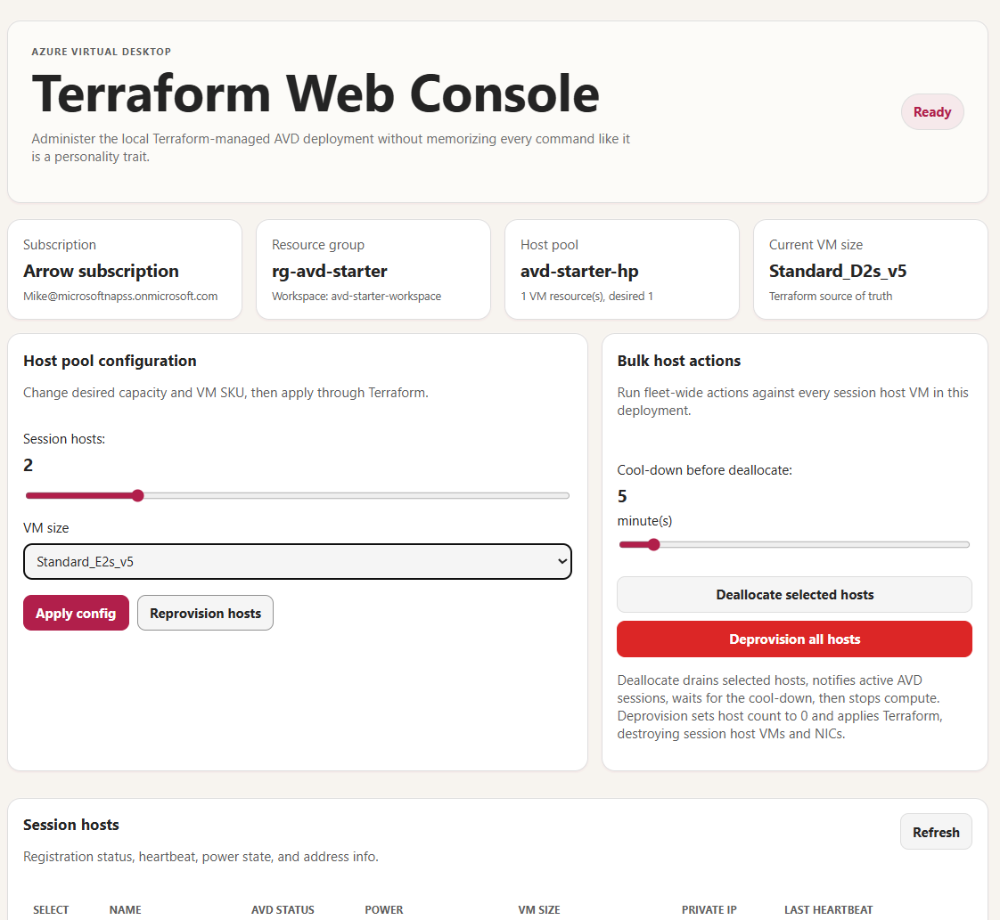

# Azure Virtual Desktop starter deployment using Microsoft Scout to generate the Terraform



Terraform project that deploys a starter Azure Virtual Desktop environment: one pooled Windows 11 session host, Entra ID join, workspace, host pool, desktop app group, networking, NSG rules, and optional user role assignments.

This folder deploys a starter Azure Virtual Desktop environment with:

- One pooled AVD host pool
- One desktop application group
- One AVD workspace and app group association
- One Microsoft Entra ID-joined Windows 11 Enterprise multi-session host
- VNet, subnet, NIC, and NSG
- Optional Microsoft Entra user/group role assignments for AVD desktop access and VM sign-in

## Prerequisites

Install Terraform and Azure CLI, then sign in:

```powershell
az login
az account set --subscription "<subscription-id-or-name>"
```

## Configure

Copy the example variables file:

```powershell
Copy-Item .\terraform.tfvars.example .\terraform.tfvars
```

Edit `terraform.tfvars`.

At minimum, set `subscription_id` if you do not want Terraform to use the current Azure CLI subscription. To grant users access, add Microsoft Entra user or group object IDs to `avd_user_object_ids`.

Set `rdp_source_address_prefix` only if you need direct RDP from a known public IP/CIDR. Leave it `null` for normal AVD-only access.

## Deploy

```powershell
terraform init
terraform fmt
terraform validate
terraform plan -out avd.tfplan
terraform apply avd.tfplan
```

## Web Console

The `webconsole` app provides a local browser UI for this deployment. It can refresh host status, show Azure Monitor telemetry, deallocate all session host VMs, deprovision/reprovision hosts with Terraform, and more.

### Installation

Navigate to the `webconsole` directory and install dependencies:

```powershell
cd webconsole
npm install
```

### Running the Web Console

Start the development server:

```powershell
npm start
```

Open `http://localhost:3000` in your browser. Keep the terminal running while using the console. The app uses the current Azure CLI session and the local Terraform state; it does not store credentials.

### Key Features

- **Host Status**: View real-time status of all AVD session hosts
- **Azure Monitor Integration**: Display telemetry and diagnostics data
- **Host Management**: Deallocate or deprovision session host VMs
- **Terraform Integration**: Reprovision hosts directly from the console UI
- **Drain Mode**: Automatically puts session hosts in drain mode during maintenance operations
- **User Notifications**: Sends save-your-work messages to active users before operations

### Retrieving Local Administrator Password

To retrieve the generated local administrator password for your hosts:

```powershell
terraform output -raw generated_local_admin_password
```

## Notes

- The deployment intentionally avoids public IP addresses.
- Direct inbound RDP is disabled unless `rdp_source_address_prefix` is set.
- The host pool RDP properties include `targetisaadjoined:i:1` and `enablerdsaadauth:i:1` for Microsoft Entra joined session host access.
- The default host count is `1`; set `session_host_count` to `0` to deprovision session hosts or increase it later when you are ready to scale.
